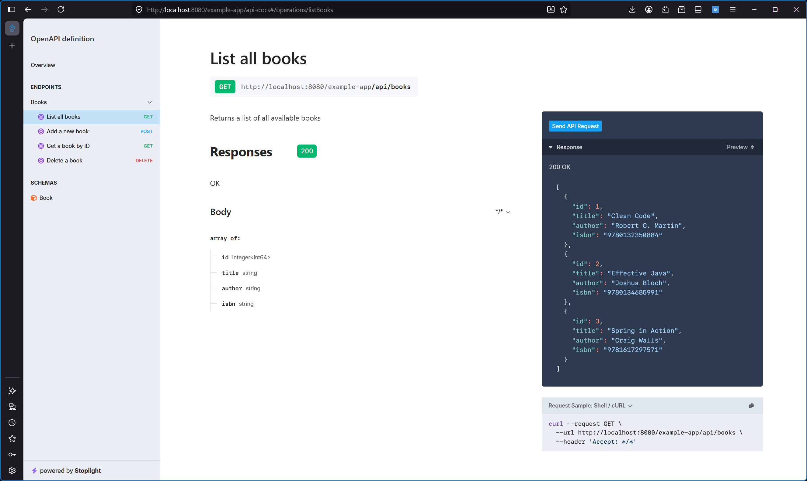

# springdoc-openapi-starter-stoplight-elements

[](https://central.sonatype.com/artifact/io.github.chandanv89/springdoc-openapi-starter-webmvc-stoplight-elements)
[](https://opensource.org/licenses/Apache-2.0)
[](https://openjdk.java.net/)
[](https://spring.io/projects/spring-boot)

A Spring Boot starter that integrates [Stoplight Elements](https://stoplight.io/open-source/elements/) API documentation UI
with [springdoc-openapi](https://springdoc.org/). Add the dependency, and get beautiful, interactive API documentation at
`/api-docs` — zero configuration required.

**Core Features**:

* Three-column sidebar layout
* Interactive "Try It" console
* Automatic code samples
* OpenAPI 3.1/3.0/2.0 support



---

## Quick Start

### 1. Add the Dependency

Just add this single dependency — it transitively includes `springdoc-openapi-starter-webmvc-api`, which provides the
`/v3/api-docs` endpoint.

**Gradle:**

```groovy
dependencies {
    implementation 'io.github.chandanv89:springdoc-openapi-starter-webmvc-stoplight-elements:1.0.0'
}
```

**Maven:**

```xml

<dependency>
    <groupId>io.github.chandanv89</groupId>
    <artifactId>springdoc-openapi-starter-webmvc-stoplight-elements</artifactId>
    <version>1.0.0</version>
</dependency>
```

For **WebFlux** applications, use the WebFlux variant instead:

```groovy
implementation 'io.github.chandanv89:springdoc-openapi-starter-webflux-stoplight-elements:1.0.0'
```

### 2. Start Your Application

```bash
./gradlew bootRun
```

### 3. Open Stoplight Elements

Visit [http://localhost:8080/api-docs](http://localhost:8080/api-docs)

That's it. No `@Configuration` classes, no bean definitions, no HTML files to create.

---

## Configuration Reference

All properties are optional and live under the `springdoc.stoplight-elements` prefix in `application.yml` or
`application.properties`.

### Core Properties

| Property                                   | Type      | Default             | Description                                         |
|--------------------------------------------|-----------|---------------------|-----------------------------------------------------|
| `springdoc.stoplight-elements.enabled`     | `boolean` | `true`              | Enable/disable the Elements UI endpoint entirely    |
| `springdoc.stoplight-elements.path`        | `String`  | `/api-docs`         | URL path where the Elements page is served          |
| `springdoc.stoplight-elements.spec-url`    | `String`  | `/v3/api-docs`      | URL of the OpenAPI specification JSON               |
| `springdoc.stoplight-elements.title`       | `String`  | `API Documentation` | HTML `<title>` of the Elements page                 |
| `springdoc.stoplight-elements.use-cdn`     | `boolean` | `false`             | Load Elements JS/CSS from CDN instead of bundled    |
| `springdoc.stoplight-elements.cdn-js-url`  | `String`  | unpkg URL           | CDN URL for Elements JS (only when `use-cdn=true`)  |
| `springdoc.stoplight-elements.cdn-css-url` | `String`  | unpkg URL           | CDN URL for Elements CSS (only when `use-cdn=true`) |

### Elements Display Options

| Property                                                 | Type      | Default   | Description                                              |
|----------------------------------------------------------|-----------|-----------|----------------------------------------------------------|
| `springdoc.stoplight-elements.layout`                    | `String`  | `sidebar` | Layout mode: `sidebar`, `responsive`, or `stacked`       |
| `springdoc.stoplight-elements.router`                    | `String`  | `hash`    | Router mode: `hash`, `history`, `memory`, or `static`    |
| `springdoc.stoplight-elements.hide-internal`             | `Boolean` | _unset_   | Filter out content marked with `x-internal`              |
| `springdoc.stoplight-elements.hide-try-it`               | `Boolean` | _unset_   | Hide the Try It feature completely                       |
| `springdoc.stoplight-elements.hide-try-it-panel`         | `Boolean` | _unset_   | Hide the Try It panel (keep Request Sample)              |
| `springdoc.stoplight-elements.hide-schemas`              | `Boolean` | _unset_   | Hide schemas in the Table of Contents                    |
| `springdoc.stoplight-elements.hide-export`               | `Boolean` | _unset_   | Hide the Export button on the overview section           |
| `springdoc.stoplight-elements.try-it-cors-proxy`         | `String`  | _unset_   | CORS proxy URL for Try It requests                       |
| `springdoc.stoplight-elements.try-it-credentials-policy` | `String`  | _unset_   | Credentials policy: `omit`, `include`, `same-origin`     |
| `springdoc.stoplight-elements.logo`                      | `String`  | _unset_   | URL to a logo image displayed next to the title          |
| `springdoc.stoplight-elements.base-path`                 | `String`  | _unset_   | Base path for history router in subdirectory deployments |

---

## Customization Examples

### Change the Endpoint Path

```yaml
springdoc:
  stoplight-elements:
    path: /docs
    title: My Service - API Reference
```

### Stacked Layout (for embedding in existing sites)

```yaml
springdoc:
  stoplight-elements:
    layout: stacked
```

### Hide Try It Feature

```yaml
springdoc:
  stoplight-elements:
    hide-try-it: true
```

### Use CDN Instead of Bundled Assets

```yaml
springdoc:
  stoplight-elements:
    use-cdn: true
    # Optionally pin a specific version:
    cdn-js-url: https://unpkg.com/@stoplight/elements@9.0.16/web-components.min.js
    cdn-css-url: https://unpkg.com/@stoplight/elements@9.0.16/styles.min.css
```

### Add a Logo

```yaml
springdoc:
  stoplight-elements:
    logo: https://example.com/my-logo.png
```

### Disable Elements

```yaml
springdoc:
  stoplight-elements:
    enabled: false
```

### Override Beans

All beans are registered with `@ConditionalOnMissingBean`, so you can replace any component:

```java

@Configuration
public class CustomElementsConfig {

  @Bean
  public StoplightElementsIndexTransformer stoplightElementsIndexTransformer(
      StoplightElementsConfigProperties properties) {
    return new MyCustomElementsIndexTransformer(properties);
  }
}
```

---

## Architecture

This starter follows the same pattern as `springdoc-openapi-starter-webmvc-ui` (Swagger UI), but for Stoplight Elements:

| Component                | Class                                | Purpose                                                        |
|--------------------------|--------------------------------------|----------------------------------------------------------------|
| **Properties**           | `StoplightElementsConfigProperties`  | Binds `springdoc.stoplight-elements.*`, builds HTML attributes |
| **Auto-Configuration**   | `StoplightElementsAutoConfiguration` | Conditional bean registration                                  |
| **Template Transformer** | `StoplightElementsIndexTransformer`  | Loads HTML template, replaces `{{placeholders}}`               |
| **Controller**           | `StoplightElementsWelcomeController` | Serves rendered HTML, hidden from OpenAPI spec                 |
| **Resource Configurer**  | `StoplightElementsWebMvcConfigurer`  | Registers resource handlers for bundled JS/CSS                 |

### Elements Asset Bundling

The Stoplight Elements web component JS (~2MB) and CSS (~290KB) are downloaded during the Gradle build via the
`downloadElementsAssets` task and bundled into the jar. This ensures:

- **Air-gapped environments** work out of the box
- **No external network calls** at runtime (unless CDN mode is enabled)
- **Version pinning** — the asset versions are locked to the build

---

## Running the Example App

```bash
./gradlew :stoplight-elements-example-app:bootRun
```

Then open:

- **Stoplight Elements UI**: [http://localhost:8080/example-app/api-docs](http://localhost:8080/example-app/api-docs)
- **OpenAPI JSON**: [http://localhost:8080/example-app/v3/api-docs](http://localhost:8080/example-app/v3/api-docs)

---

## Building from Source

```bash
# Full build (downloads Elements assets, compiles, runs tests)
./gradlew build

# Compile only
./gradlew :springdoc-openapi-starter-webmvc-stoplight-elements:compileJava

# Publish to local Maven repository
./gradlew publishToMavenLocal
```

---

## Testing

```bash
# Run all tests
./gradlew :springdoc-openapi-starter-webmvc-stoplight-elements:test

# Run a specific test class
./gradlew :springdoc-openapi-starter-webmvc-stoplight-elements:test --tests "*.StoplightElementsConfigPropertiesTest"
```

---

## Requirements

- **Java 17+**
- **Spring Boot 3.x**

`springdoc-openapi-starter-webmvc-api` is included as a transitive dependency — no need to add it separately.

---

## License

Apache License 2.0 — see [LICENSE](LICENSE) for details.

This project bundles [Stoplight Elements](https://github.com/stoplightio/elements) (Apache 2.0 License) — see [NOTICE](NOTICE) for
attribution.
